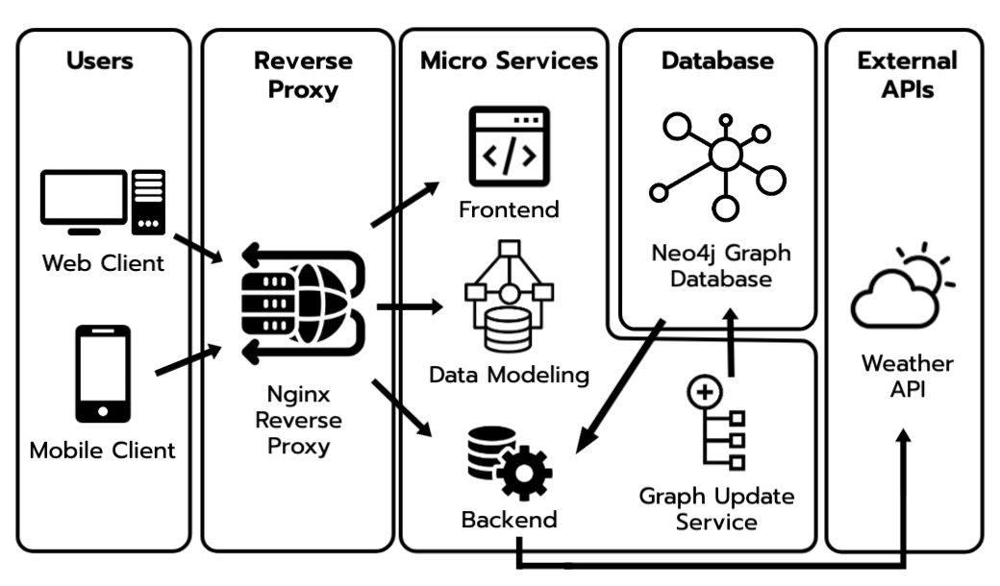

# ClearPath

## About The Project

This project formed a major component of my Masters in Computer Science at UCD. Over a 10 week period in summer 2024, we were tasked to develop and deploy an application that utilised "busyness" and was set in NYC. Each team of six had distinct roles. As Team Coordination Lead, I was primarily tasked with coordinating team efforts. I was in charge of tracking progress, maintaining documentation and updating records. In terms of code work, I worked extensively on the machine learning model/data analytics, as well as assisting in backend development.

Our final application, ClearPathNYC, is aimed at joggers and pedestrians in Manhattan. It offers the following functionalities: 
- 

Clips of the running application have been compiled here: [https://youtu.be/LlCiB7U1NTI])

## Built With 

We built each of the services in this application as microservices, deploying them with Docker. It includes a JavaScript React frontend, a C# .NET backend, a NoSQL (Neo4j) backend for containing routing information and a .NET service for updating the other database. XGBoost models and a Flask service interact with the models to calculate predictive crowding levels. 

The diagram below illustrates how they work together.

## Acknowledgements 

Huge thanks go to my team members Dillon (Data Lead), Michael (Backend Lead), Adam H. (Customer Lead), Adam S. (Maintenance Lead) and Yuhan (Frontend Lead). I was blessed to work with a group of talented, conscientious and dependable people. Together, we produced a project we all look back on with pride. 
As module coordinators, Michael O'Mahony and Gavin McArdle provided invaluable guidance and constructive feedback.

<!-- MARKDOWN LINKS & IMAGES -->
